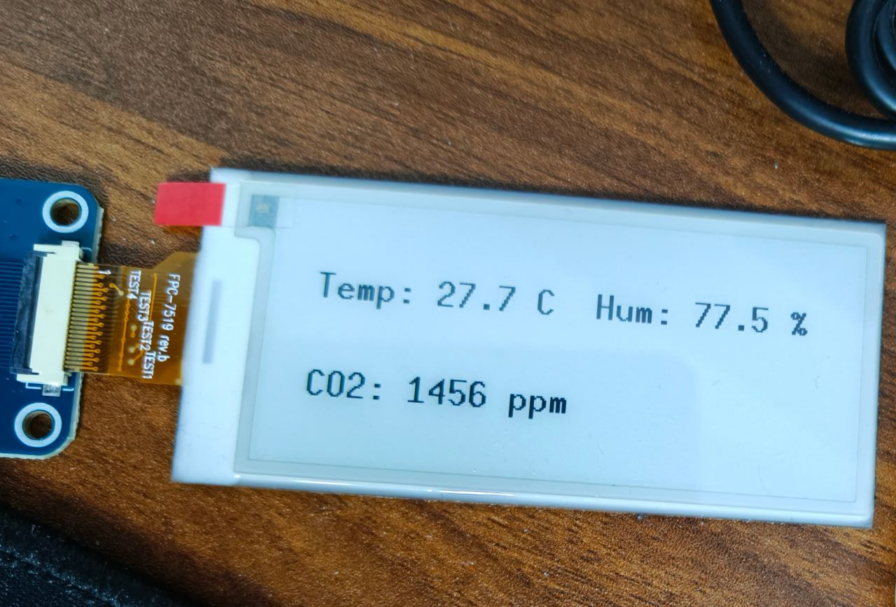
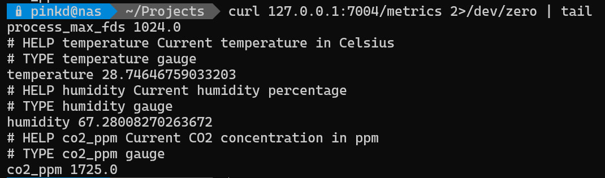
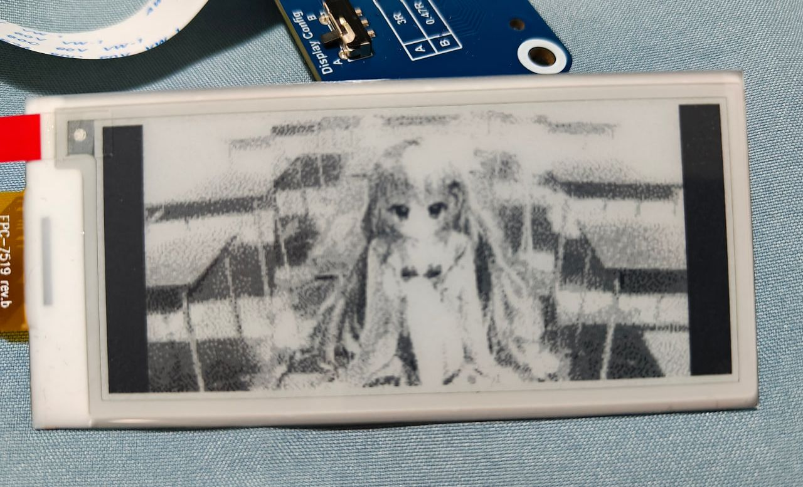

# co2 monitor

Measure temperature/humidity/co2 using esp32 and scd41 sensor, then display the result with e-ink screen

## run

> NOTE: require [toolchain](https://docs.espressif.com/projects/rust/book/getting-started/toolchain.html) and CH340 driver

```bash
cargo run --package co2-monitor --bin co2-monitor
```

### run metric server

```bash
cd metric_server
docker build -t co2-monitor-server .
docker run -d --name co2-monitor-server -p 7004:7004/udp -p 127.0.0.1:7004:7004/tcp co2-monitor-server:latest
# add 127.0.0.1:7004 to your prometheus config
vim /etc/prometheus/prometheus.yml
```

## hardware

- esp32: https://sensirion.com/media/documents/48C4B7FB/67FE0194/CD_DS_SCD4x_Datasheet_D1.pdf
- e-paper: 
  - https://www.waveshare.net/wiki/Pico-ePaper-2.9
  - https://www.waveshare.net/w/upload/7/79/2.9inch-e-paper-v2-specification.pdf

## demo

### monitor with scd41



### export metric for prometheus



### show img with e-ink

> ref: `src/bin/main.rs#_backup_for_img_display`

origin: 

https://palette.clearrave.co.jp/product/kokoiro/


origin(gray):


result:


